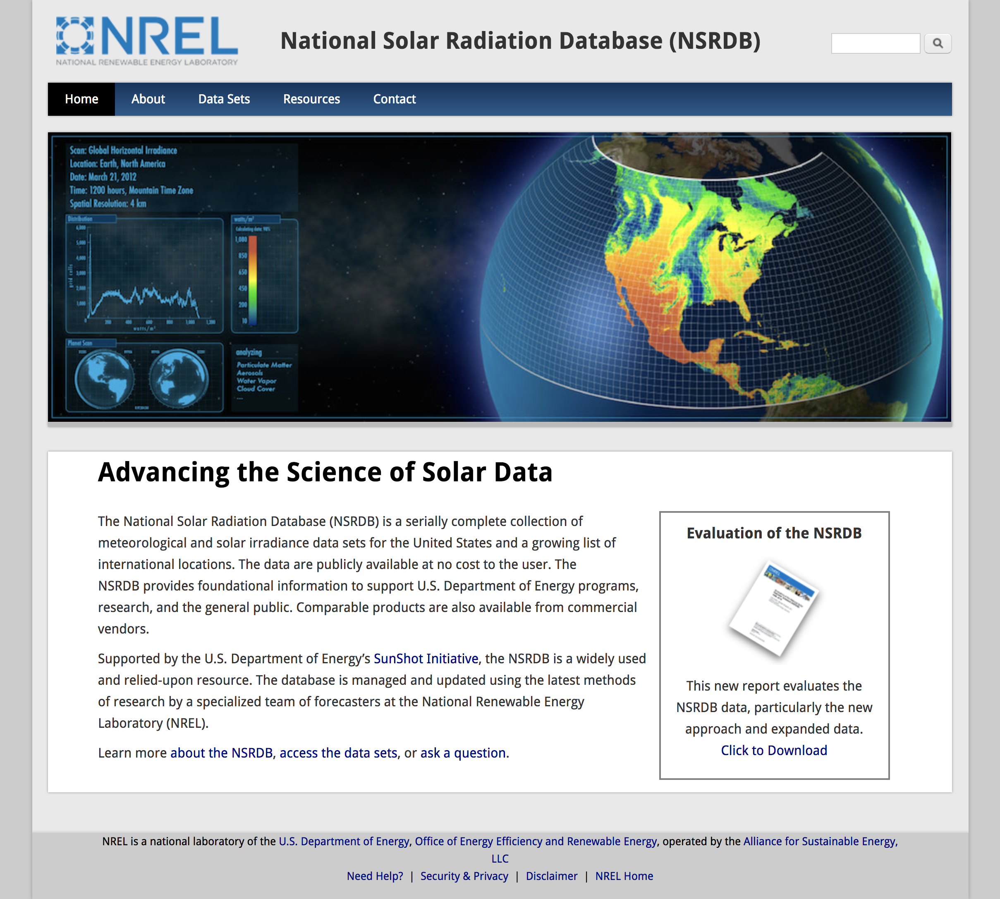

# National Solar Radiation Database
## Overview

Partner project to redesign the National Solar Radiation Database (NSRDB) website to make the site more modern, sleek and user-friendly. NSRDB is one of NREL's most popular databases. 
Process included meeting with the client multiple times to discuss their goals and strategize to ensure the design adhered to their vision. We had creative liberty for the layout and design.
We built multiple static pages using HTML5 and CSS3.

## Collaborators
Maddy Dannenberg: [https://github.com/mmdberg]
Sabrina Kennedy: [https://github.com/skenne21]

## Screenshots

